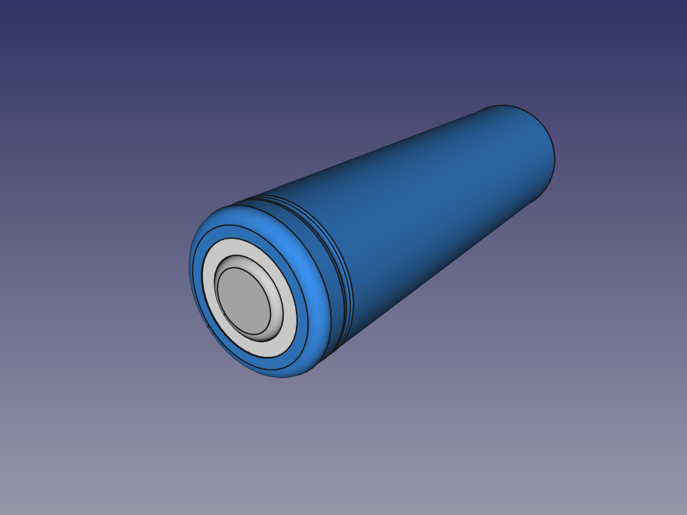

# 18650 battery
A 18650 battery (without protection) model needed for the [powerClon-v2](https://github.com/mgesteiro/FreeCAD/powerClon-v2/), from our project [mClon](https://mclon.org).

## LICENSE

This work is licensed under the [GNU General Public License v3.0](../LICENSE-GPLV30). All media and data files that are not source code are licensed under the [Creative Commons Attribution 4.0 BY-SA license](../LICENSE-CCBYSA40).

More information about licenses in [Opensource licenses](https://opensource.org/licenses/) and [Creative Commons licenses](https://creativecommons.org/licenses/).
