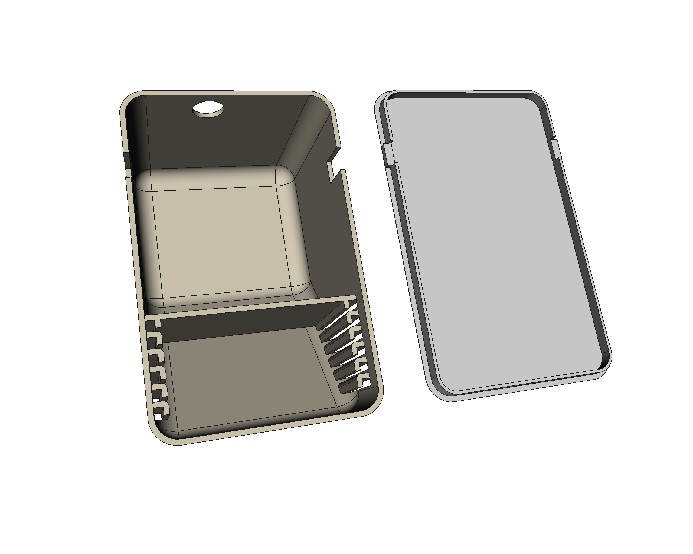

# Commodore 64 wedge Power Supply Unit box
A Commodore 64 8-bit computer PSU box: wedge version. Built from scratch with [FreeCAD](https://freecadweb.org).

There's also a personalized version for [Noel's Retro Lab channel](https://discord.com/channels/697529048318083206/697529049018400841) in [STL form](C64-wedge-PSU-TOP-RL.stl).

## LICENSE

This work is licensed under the [GNU General Public License v3.0](../LICENSE-GPLV30). All media and data files that are not source code are licensed under the [Creative Commons Attribution 4.0 BY-SA license](../LICENSE-CCBYSA40).

More information about licenses in [Opensource licenses](https://opensource.org/licenses/) and [Creative Commons licenses](https://creativecommons.org/licenses/).
