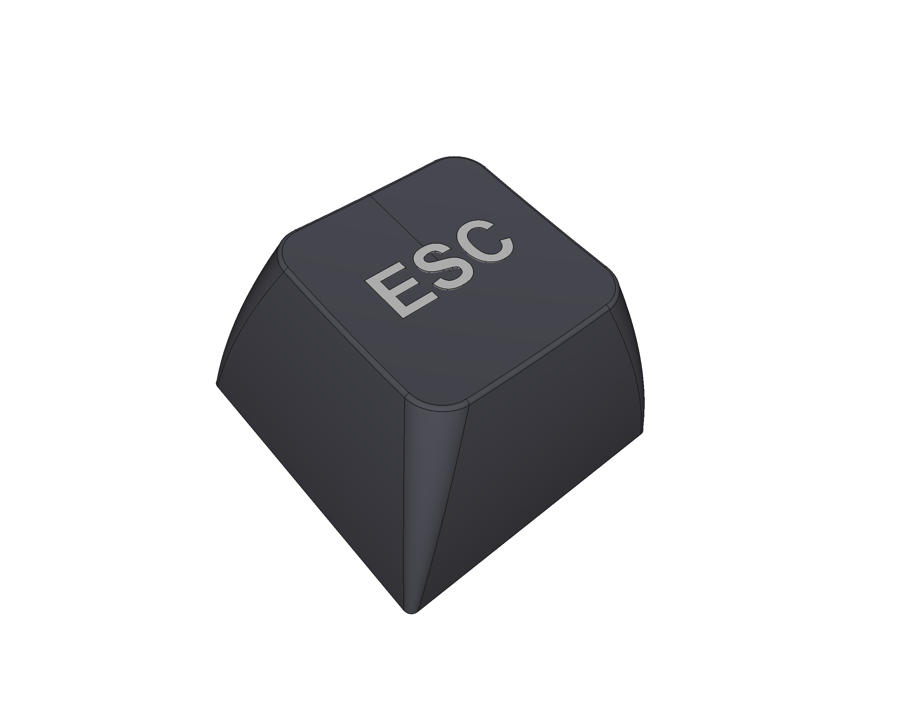
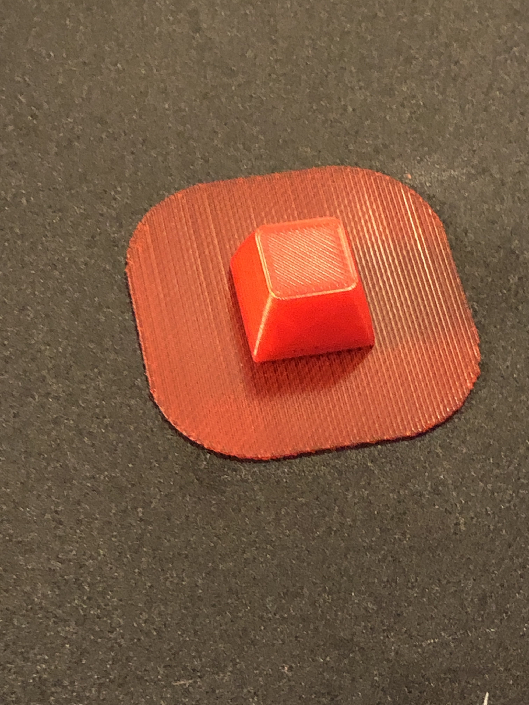
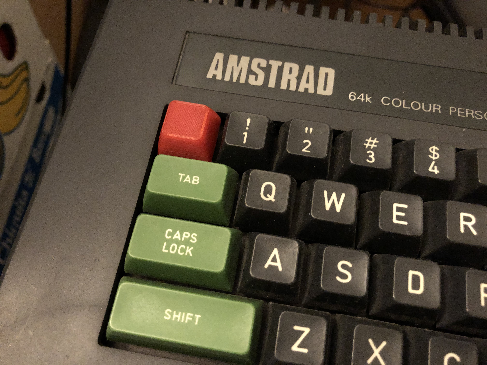

# Amstrad CPC keycap
An Amstrad CPC 8-bit computer keycap model: version tall. Built from scratch with [FreeCAD](https://freecadweb.org) using some pictures kindly provided by @RetroBard at [Noel's Retro Lab Discord channel](https://discord.com/channels/697529048318083206/697529049018400841).

## Demo
Update: @RetroBard send pictures of the result! 😊💪

 

## LICENSE

This work is licensed under the [GNU General Public License v3.0](../LICENSE-GPLV30). All media and data files that are not source code are licensed under the [Creative Commons Attribution 4.0 BY-SA license](../LICENSE-CCBYSA40).

More information about licenses in [Opensource licenses](https://opensource.org/licenses/) and [Creative Commons licenses](https://creativecommons.org/licenses/).
