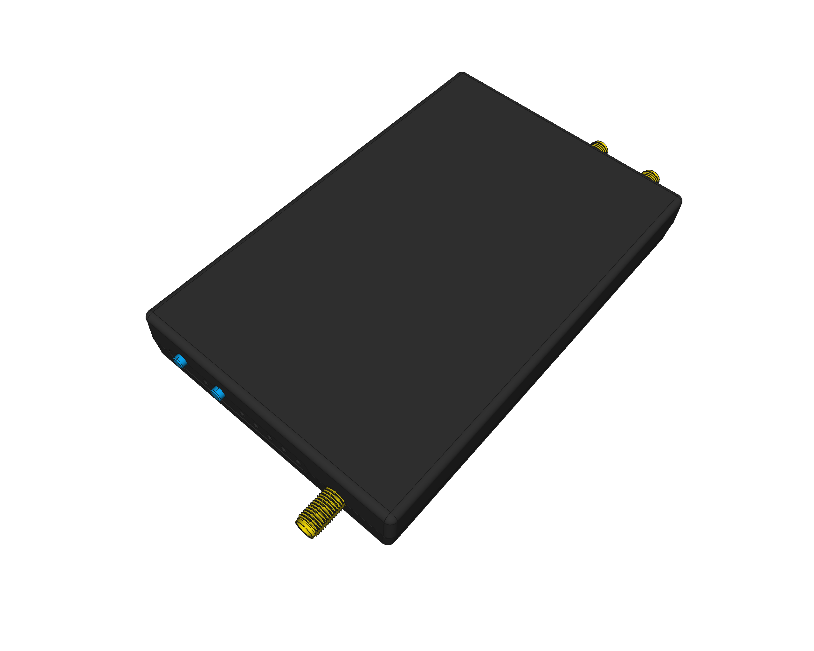

# HackRF-One 3D model
A HackRF-One standard black plastic case 3D model built from scratch with [FreeCAD](https://freecadweb.org). Based on pictures and real physical measures, trying to be as precise as possible (even replicating some of the "defects"). Useful for modelling arround it during integration in other projects.

## LICENSE

This work is licensed under the [GNU General Public License v3.0](../LICENSE-GPLV30). All media and data files that are not source code are licensed under the [Creative Commons Attribution 4.0 BY-SA license](../LICENSE-CCBYSA40).

More information about licenses in [Opensource licenses](https://opensource.org/licenses/) and [Creative Commons licenses](https://creativecommons.org/licenses/).
