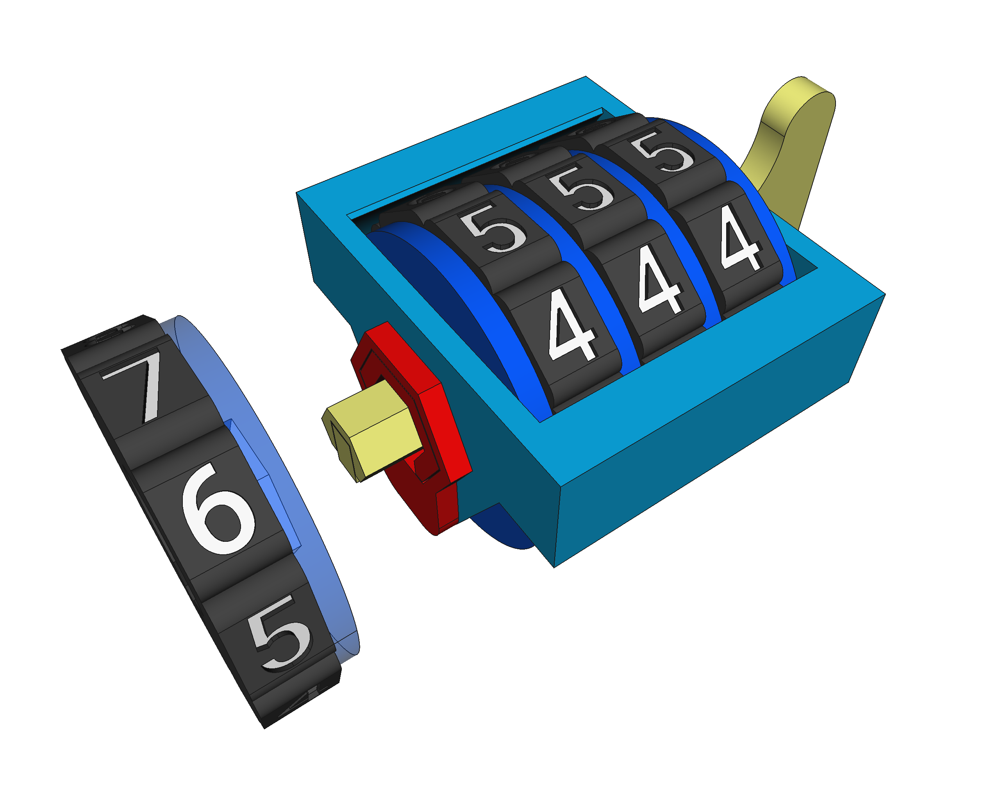

# FreeCAD models & parts
My own FreeCAD models & parts repository, mainly used in my own projects and **shared here** to contribute to the **Maker/Open-source/Open-hardware commons**.

## REMARKABLE PROJECTS
There are two remarkable models worth highlighting that can be considered projects on their own. Click on the image to see details:

### Axis-Cross

### Combination-Lock

## LICENSE

This work is licensed under the [GNU General Public License v3.0](LICENSE-GPLV30). All media and data files that are not source code are licensed under the [Creative Commons Attribution 4.0 BY-SA license](LICENSE-CCBYSA40).

More information about licenses in [Opensource licenses](https://opensource.org/licenses/) and [Creative Commons licenses](https://creativecommons.org/licenses/).
