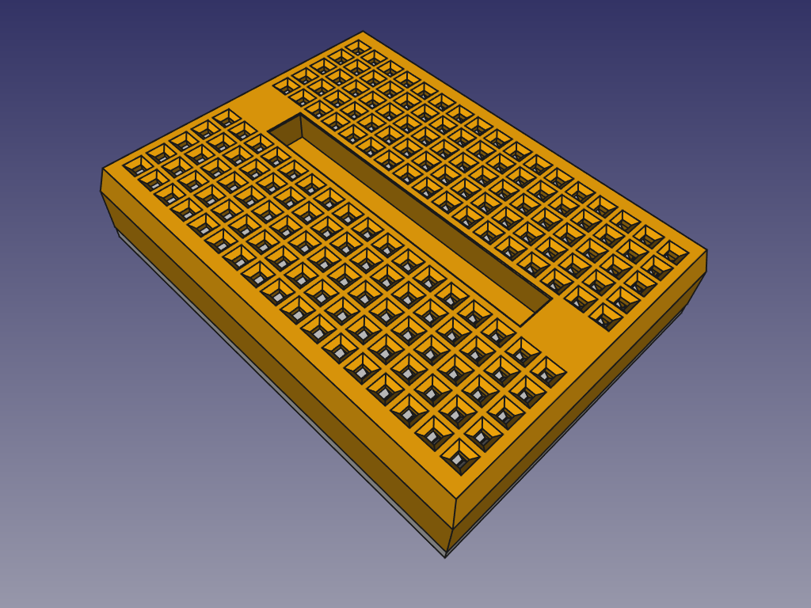

# Robotdyn mini breadboard 170
An 170 contacts mini breadbord 3D model, based on [the Robotdyn part](https://robotdyn.com/breadboard-mini.html), which doesn't have mounting screw holes or connectors for other breadboards.

## LICENSE

This work is licensed under the [GNU General Public License v3.0](../LICENSE-GPLV30). All media and data files that are not source code are licensed under the [Creative Commons Attribution 4.0 BY-SA license](../LICENSE-CCBYSA40).

More information about licenses in [Opensource licenses](https://opensource.org/licenses/) and [Creative Commons licenses](https://creativecommons.org/licenses/).
