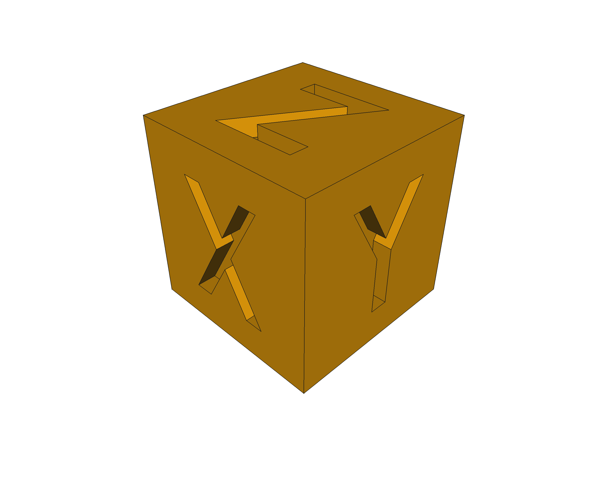

# XYZ Calibration Cube
After [EInsua](https://github.com/einsua) finding-out that the famous [XYZ-Callibration-Cube](https://www.thingiverse.com/thing:1278865) was *"incorrect"* (letters not centered and even not straigth), **I had to™** create a *"valid"* model, using [FreeCAD](https://FreeCADweb.org) (the same tool as the [original author](https://www.idig3dprinting.co.uk/news/how-to-guides/create-a-3d-printer-calibration-cube-in-freecad/), but **well done™**!).

You can download the [FreeCAD file](XYZ-Cube.FCStd) and the [STL file](XYZ-Cube.stl) also.

PD: this is some sort of *a tribute* to the original author and FreeCAD itself 😊

## LICENSE

This work is licensed under the [GNU General Public License v3.0](../LICENSE-GPLV30). All media and data files that are not source code are licensed under the [Creative Commons Attribution 4.0 BY-SA license](../LICENSE-CCBYSA40).

More information about licenses in [Opensource licenses](https://opensource.org/licenses/) and [Creative Commons licenses](https://creativecommons.org/licenses/).
