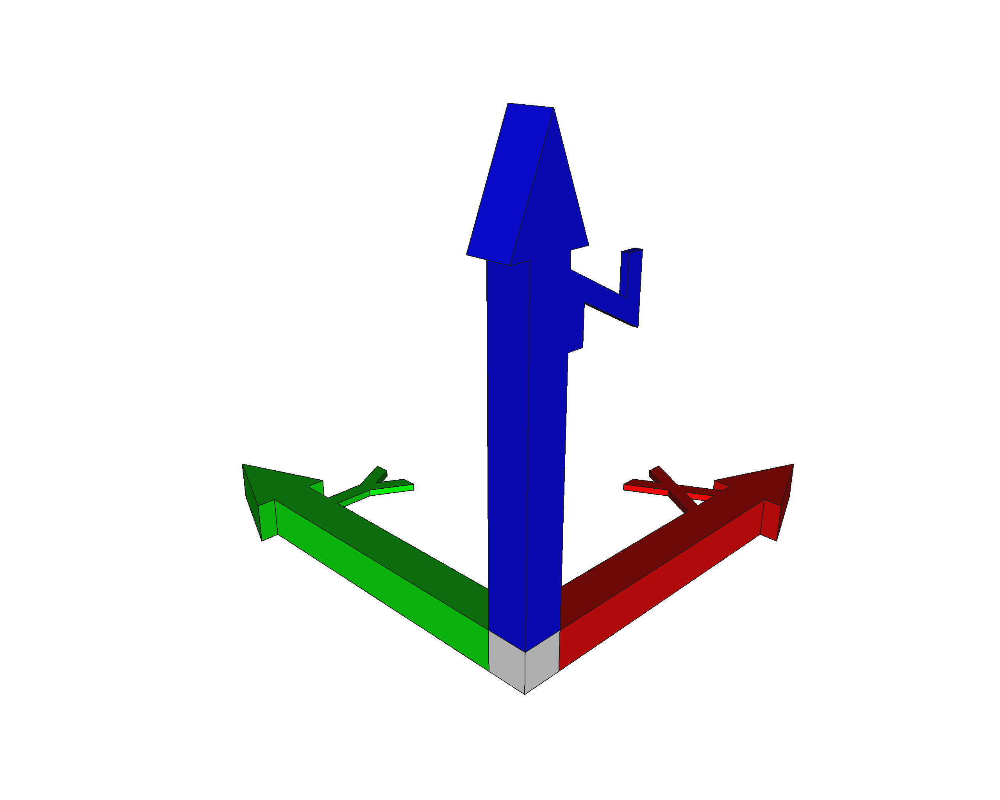
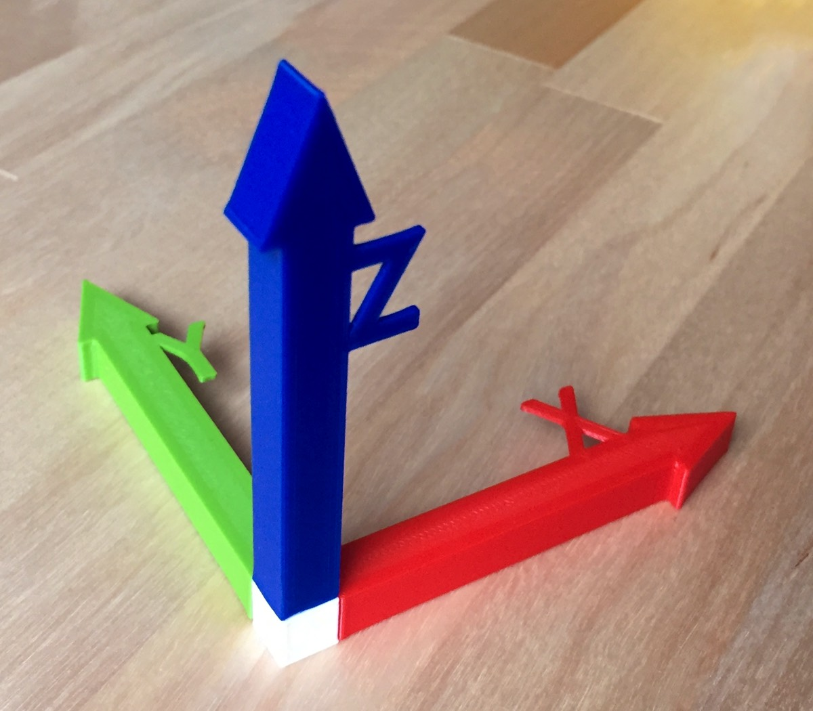

# Axis cross
A 3D model to be 3D printed, representing the [FreeCAD](https://freecadweb.org) axis cross, useful to explain space geometry.

## How to use it
This model is a little puzzle that I give unassembled to my apprentices -as a gift- during my FreeCAD/3D-printing workshops: they have to mount it before I start explaining. It has also some interesting (and clever!) properties:

* the pieces can only be put together in a way, to preserve the axis geometry itself. It is easy to assemble and requieres almost *any force* to be mounted (if you need to push hard, you're doing it wrong 😉).
* only sits **completly flat** in a position: with the Z-blue-axis pointing upward.
* once it's flat on a surface (e.g. your desk), **if you can "read straight" al three letters**, then the X-red-axis is pointing to the right, the Y-green-axis to the front, and the Z-blue-axis upward (like in the image): this is the typical initial state/position of the reference XYZ coordinate system axis-cross 👌

Once it's mounted and in the *correct* position, it's easier to explain the axis, the planes, etc. And they can go back to it whenever they doubt, until, eventually, they don't need it any more (time to pass it to the next person?).

## Printing
You'll find in this repository all the necessary STL files of the four pieces ready to print, with a default printing **tolerance** of <code>0.225 mm</code>. Adjust this configuration parameter if your printer requires it.

You could scale the STLs up or down, but I don't recommend it because the 3D-printing tolerance will scale too (that shouldn't). If you really want to scale them, use the FreeCAD file and simply edit and change it to fit your needs and export a new set of STL files.

**NOTE:** no support required for printing (yay! 😎)

## LICENSE

This work is licensed under the [GNU General Public License v3.0](../LICENSE-GPLV30). All media and data files that are not source code are licensed under the [Creative Commons Attribution 4.0 BY-SA license](../LICENSE-CCBYSA40).

More information about licenses in [Opensource licenses](https://opensource.org/licenses/) and [Creative Commons licenses](https://creativecommons.org/licenses/).
