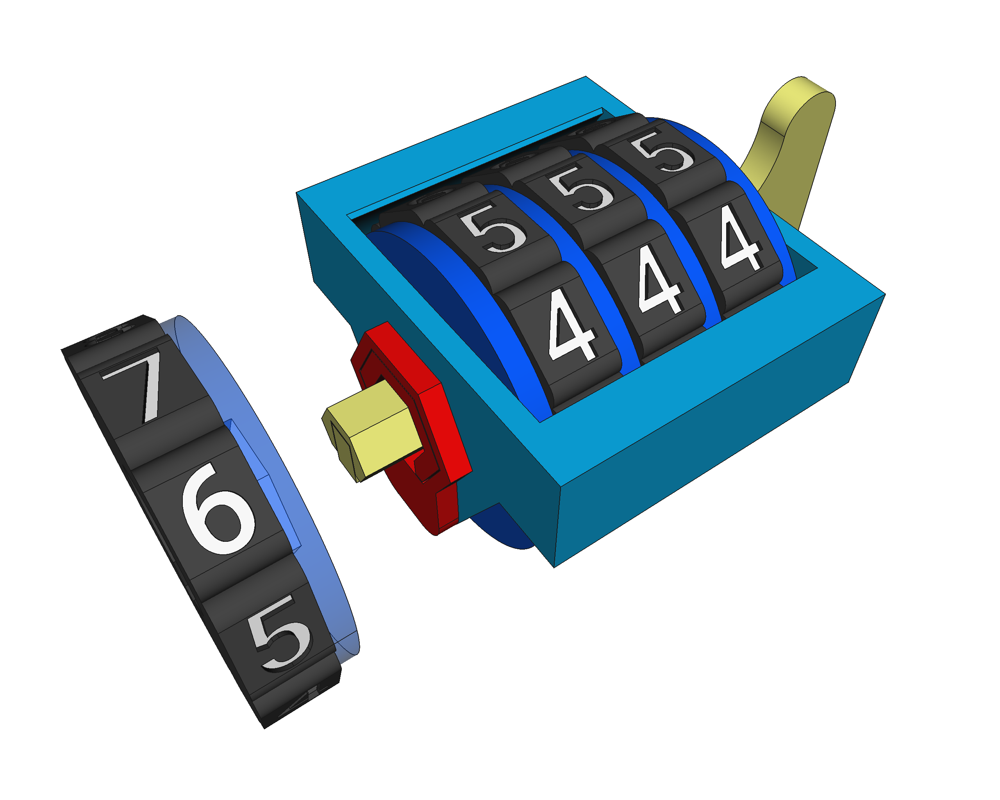
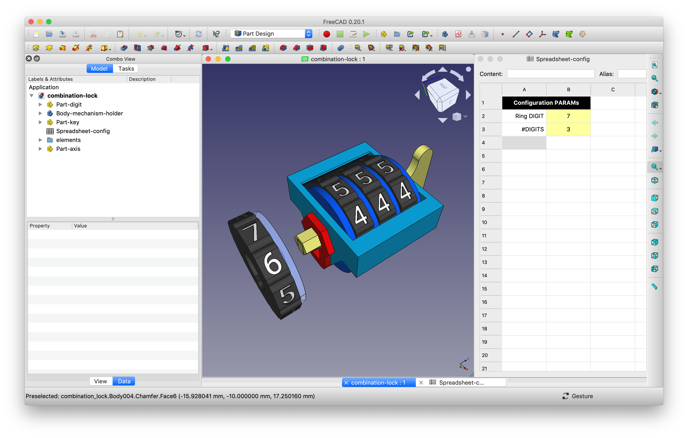
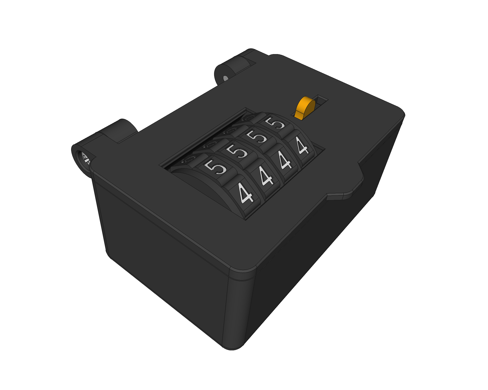
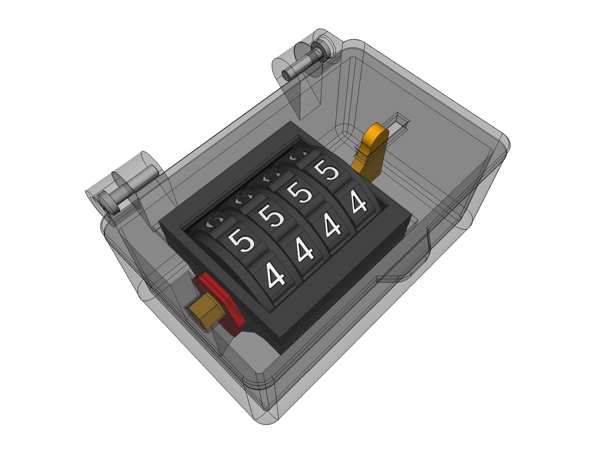
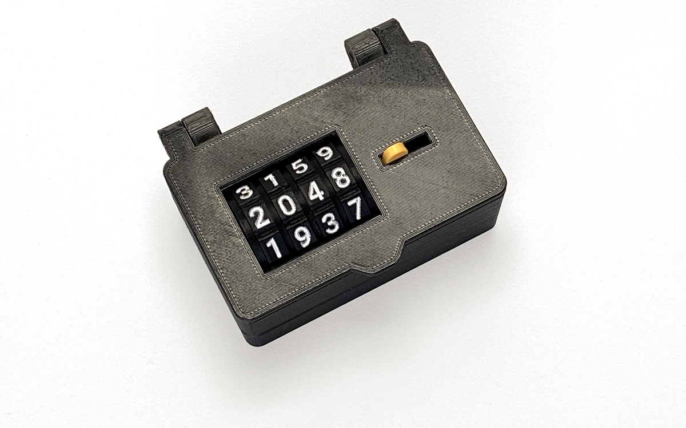
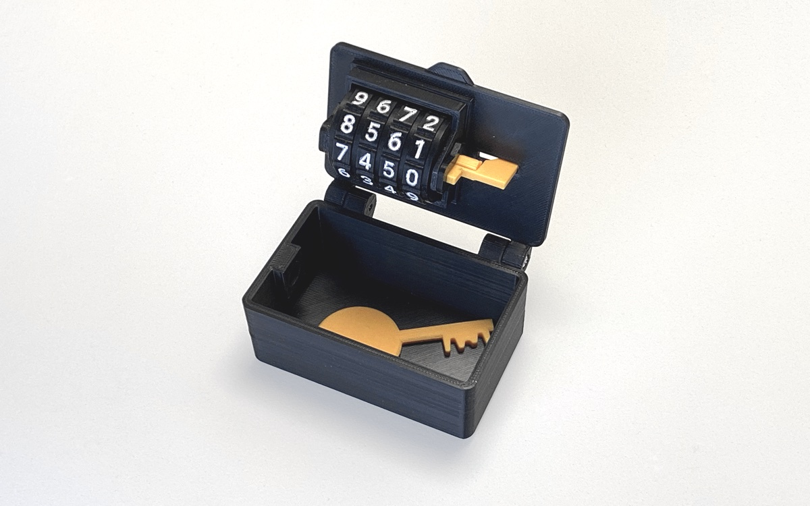

# Combination Lock
This is a parametric 3D model of a [very satisfactory] *clicking* **combination lock**, designed to be 3D printed while being used (integrated) into other 3D models. Built from scratch with [FreeCAD](https://freecadweb.org).

As it is a parametric model, a lock with **any number of digits** can be generated.

## Configuration
Once opened in FreeCAD, the 3D-model can be configured to have the number of digits you'd like by entering the field `#DIGITS` in the parametric tab.

The `Ring DIGIT` field is used to stablish the **valid number** in the **digit ring-piece** itself (the one to the left), that you can use to generate your own personalized combination: if you want a lock with a combination of, for example, `1234`, you'll have to generate four different rings, with the `Ring DIGIT` property set to everyone of those four digits (one each time).

In the [`STLs`](STLs) folder there are already available all the 10 different possible rings (from 0 to 9), along with all the other pieces necessary for a two, three or four combination lock, ready to be 3D-printed.

## Integration

Although you can print the model as it is (why not? ❤️), it was created to be integrated into other items like, for example, a box, like the **minimalistic** `sample-box.FCStd` model available in this same repository:

Use that model as an example, basis or template: it works!

**NOTE:** The numbers where marked with a white-ink ballpen 👌

## Design

I created this design for a few bunch of different reasons:

* I needed it for puzzle-boxes, escape rooms and other educational material.
* The mechanical design challenge itself: learned a lot on how *these things work ™*.
* 3D printing friendly model: many details where decided taking this requirement into account
	* No supports required while 3D-printing.
	* 3D-printing parts' orientation optimized to achieve maximum resistance possible.
	* Combination is **fixed** and there is no *reconfiguration mechanism* (simplicity!).
* *Clickly-ness*: again, very satisfactory rachet mechanism!

If you have any sugestion, please contact me!

## LICENSE

This work is licensed under the [GNU General Public License v3.0](../LICENSE-GPLV30). All media and data files that are not source code are licensed under the [Creative Commons Attribution 4.0 BY-SA license](../LICENSE-CCBYSA40).

More information about licenses in [Opensource licenses](https://opensource.org/licenses/) and [Creative Commons licenses](https://creativecommons.org/licenses/).
