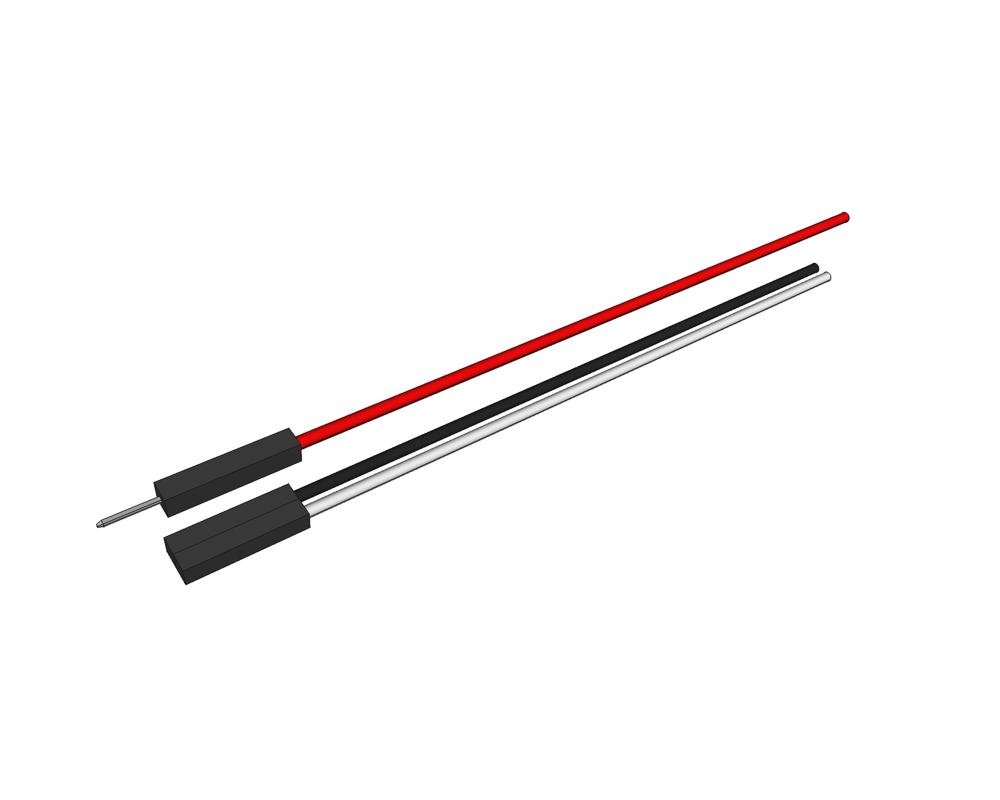

# Dupont cable
A dupont cable (or wire, or jumper) 3D model, used in many of my projects. Built from scratch with [FreeCAD](https://freecadweb.org).

This is the *squared* shaped header type, with the longest size i've found (the worst case scenario), used to validate assemblies. There are female and male versions.

## LICENSE

This work is licensed under the [GNU General Public License v3.0](../LICENSE-GPLV30). All media and data files that are not source code are licensed under the [Creative Commons Attribution 4.0 BY-SA license](../LICENSE-CCBYSA40).

More information about licenses in [Opensource licenses](https://opensource.org/licenses/) and [Creative Commons licenses](https://creativecommons.org/licenses/).
