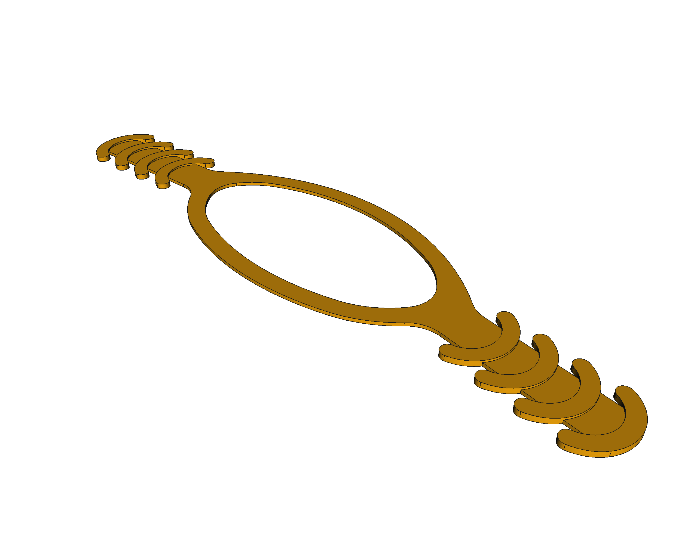
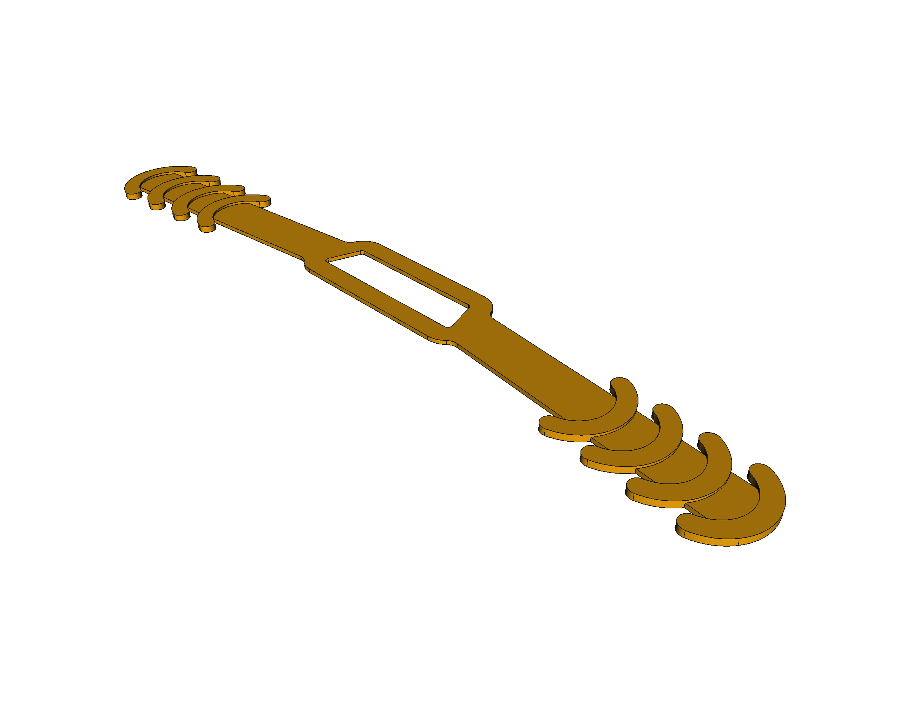

# COVID-19 surgical mask ear saver strip
Two protection strip 3D models to be 3D printed. Built from scratch with [FreeCAD](https://freecadweb.org) during the 2019 Covid pandemic. Useful to avoid prolongued contact from the surgical masks strips with the ears when worn for long hours.

### Standard version

### Streched version

## LICENSE

This work is licensed under the [GNU General Public License v3.0](../LICENSE-GPLV30). All media and data files that are not source code are licensed under the [Creative Commons Attribution 4.0 BY-SA license](../LICENSE-CCBYSA40).

More information about licenses in [Opensource licenses](https://opensource.org/licenses/) and [Creative Commons licenses](https://creativecommons.org/licenses/).
