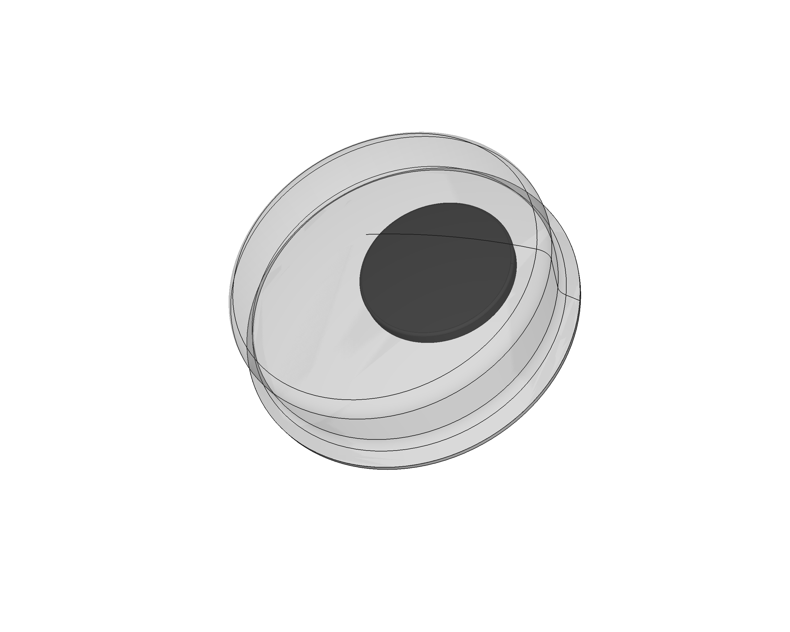

# Giggling eye
A giggling eye 3D model used in our Escornabot models. Built from scratch with [FreeCAD](https://freecadweb.org). Everything is better with *giggling eyes* ...

It's parametric so yo can create your own size variant by just typing the numbers. It comes with some presets (those that I have myself at hand).

## LICENSE

This work is licensed under the [GNU General Public License v3.0](../LICENSE-GPLV30). All media and data files that are not source code are licensed under the [Creative Commons Attribution 4.0 BY-SA license](../LICENSE-CCBYSA40).

More information about licenses in [Opensource licenses](https://opensource.org/licenses/) and [Creative Commons licenses](https://creativecommons.org/licenses/).
