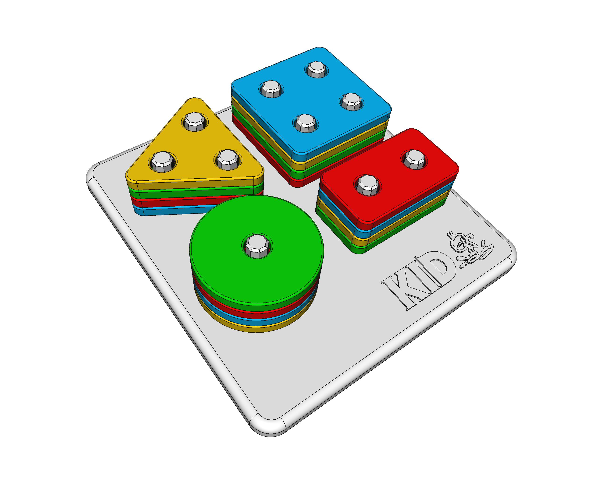

# Kid Toy
A 3D model of a kid's toy to be 3D printed. 

## Notes

* The pegs are designed to be printed horizontally (as the [STL file](peg.stl) is) for maximum resistance.
* Base mounting holes and pegs tolerance is designed to be a *tight fit*, so the pegs don't move once installed.
* **Be careful** of which materials you use to print this: **kids put everything in their mouth!**

## Printing
You'll find in this repository all the necessary STL files for all the pieces ready to be sliced and printed. Please note that 10 pegs are required.

The [FreeCAD file](kid-toy.FCStd) is parametric, with a *Config page* in which you can adjust - among others - the printing **tolerance**  (default is <code>0.150 mm</code>): adjust this configuration parameter if your printer requires it.

You can also personalize the model too, putting your kid's name instead of *"KID"*. Use the [FreeCAD software](https://freecadweb.org) for that.

**NOTE:** no support required for printing (yay! 😎)

## LICENSE

This work is licensed under the [GNU General Public License v3.0](../LICENSE-GPLV30). All media and data files that are not source code are licensed under the [Creative Commons Attribution 4.0 BY-SA license](../LICENSE-CCBYSA40).

More information about licenses in [Opensource licenses](https://opensource.org/licenses/) and [Creative Commons licenses](https://creativecommons.org/licenses/).
