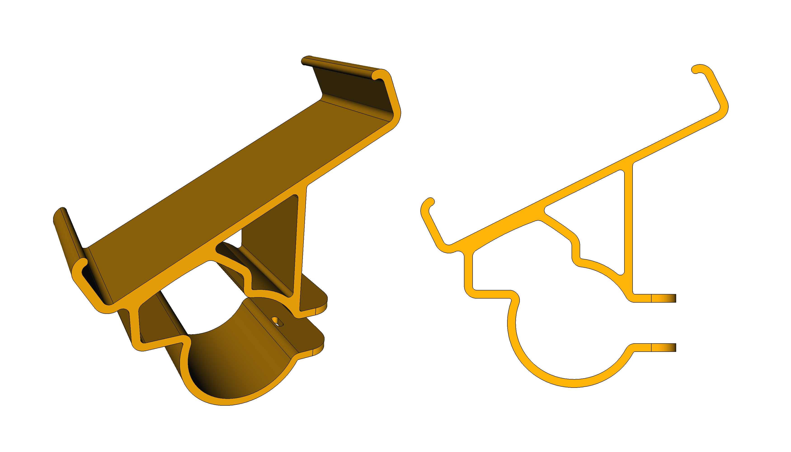
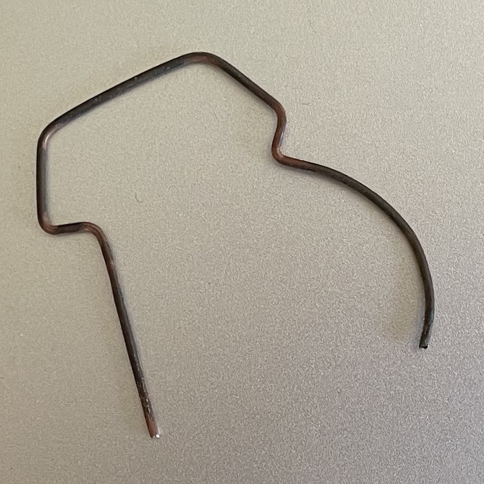
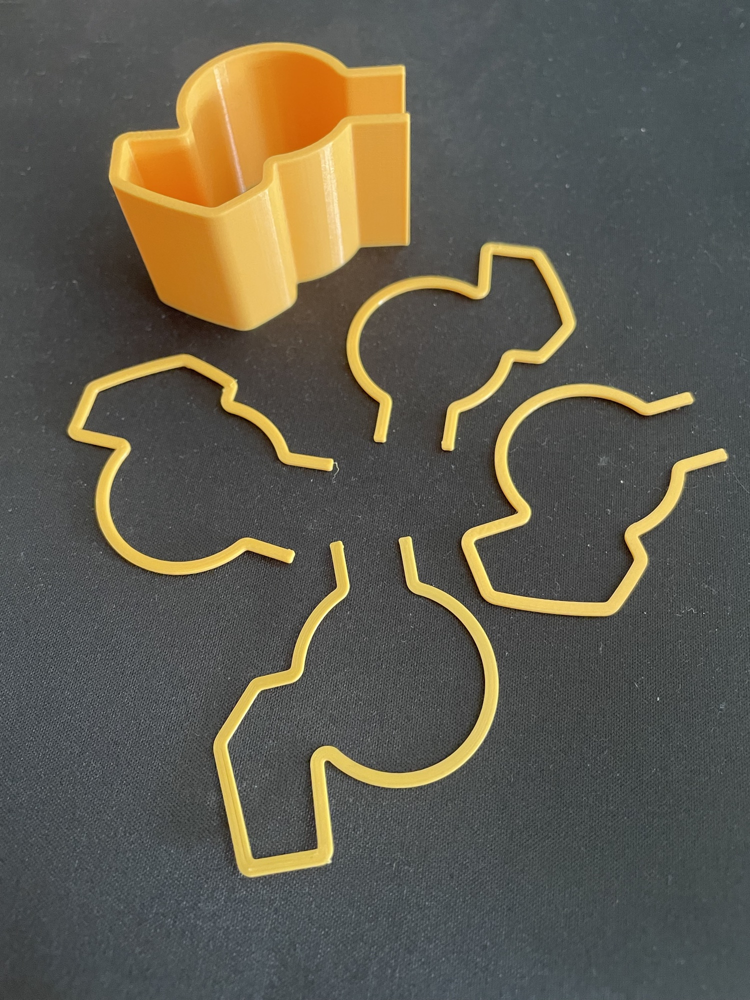
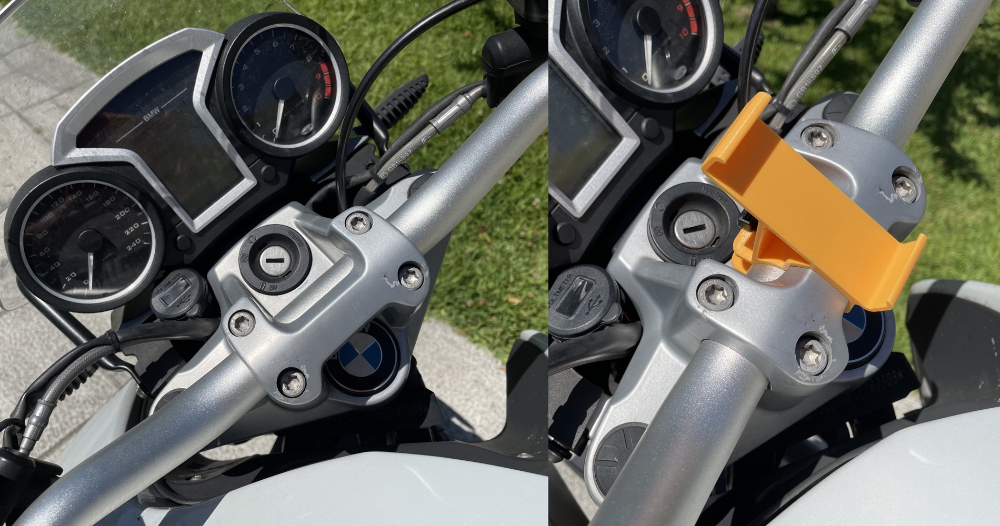
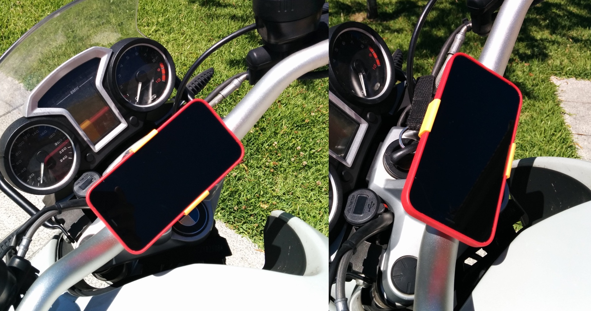

# Motorbike mobile support for the handlebars

This is a mobile support that I designed for a [**2012 BMW R1200R**](https://duckduckgo.com/?q=bmw+r1200r+2012&iax=images&ia=images#) that can be 3D printed. It clamps into the handlebars and its bracket, and is fixed in place with a simple zip-tie (yep, NO screws at all!).

## Why?
Because of all **these advantages**:

* [KISS design](https://en.wikipedia.org/wiki/KISS_principle): lightweight, simple and efficient.
* No modifications on the bike required at all.
* No screws = no metal. Simpler to install, cheaper and nothing can rust.
* Easy to adapt for any mobile size (contact me if you need help).
* Easy to print: no special requirements like supports or fancy settings or materials (regular PLA will do).
* Dirty cheap (less than 1 €) so you can stop worrying about it (robbery, breaking ...).
* It works very very well.
* Open-Source: go ahead and make your own version from it!

## How?
It took me a while to figure out how to model this piece, because the handlebars tube is not circular but elliptical (or *flattened*), and the bracket has its own particular non-trivial shape. I tried iniatially to take meausurements with the caliper but finally I ended up doing these steps:

1. With a caliper I measured the widest (width) and narrowest (height) dimensions of the handlebars tube and created the ellipse in FreeCAD.
2. Using a soft wire bent around the bracket itselft, I managed to get a profile of the shape that then I translated it into FreeCAD (via a picture) to complete the clamp design.
3. 3D-printed various iterations of the profile and finetuned it to be as-good-as-possible fit.

## Install
Just spread it open (don't be afraid) and push until it clamps into position. Make sure it's centered before inserting the zip-tie. Tighten the zip-tie and cut the remaining.

The upper part of the mobile clamp is flexible enough to bend it slightly until you get your mobile in place. If it slides, you can add some rubber tape to the back surface.

## Result

## LICENSE

This work is licensed under the [GNU General Public License v3.0](../LICENSE-GPLV30). All media and data files that are not source code are licensed under the [Creative Commons Attribution 4.0 BY-SA license](../LICENSE-CCBYSA40).

More information about licenses in [Opensource licenses](https://opensource.org/licenses/) and [Creative Commons licenses](https://creativecommons.org/licenses/).
