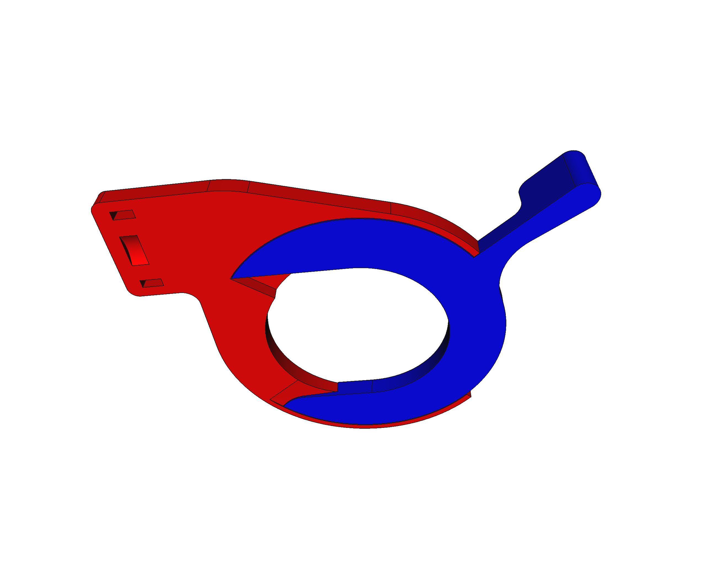
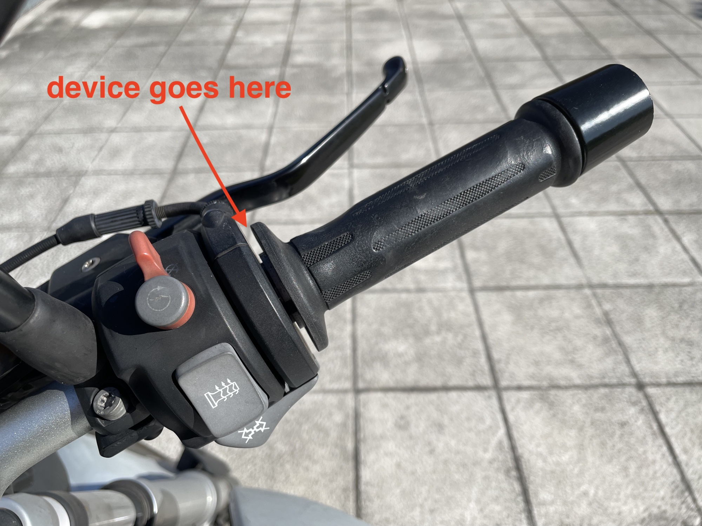
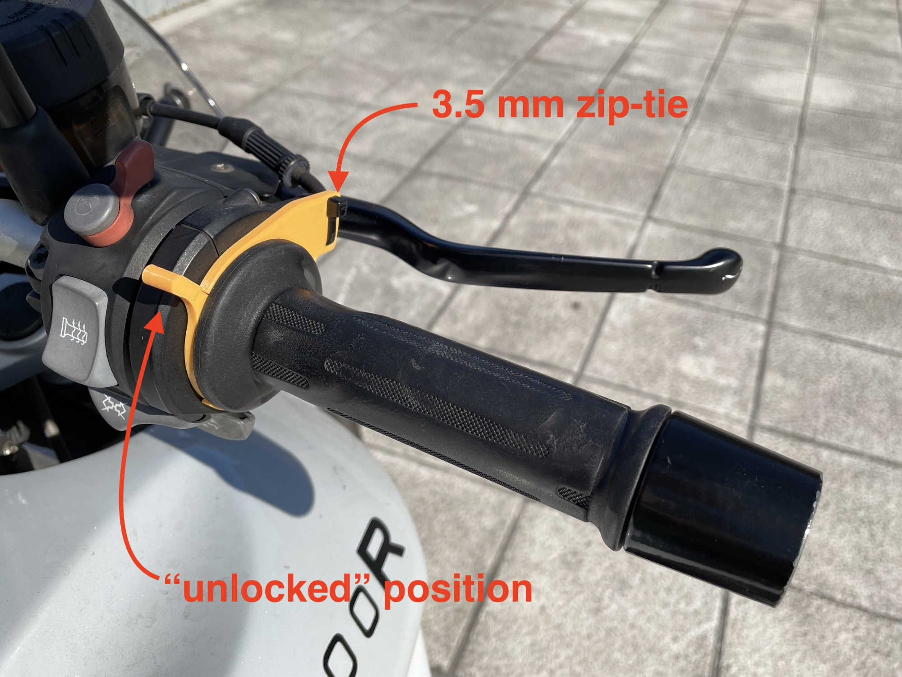

# Motorbike throttle lock / cruise control

This is a throttle lock/cruise control that I adapted/redesigned for a [**2012 BMW R1200R**](https://duckduckgo.com/?q=bmw+r1200r+2012&iax=images&ia=images#) that **can be 3D printed**. It fits in the gap between the accelerator rubber handle and its case, and is held in place with a simple zip-tie (yep, NO screws at all!).

## Why?

Because throttle locks are **EXPENSIVE** for what they do and really are (with some exceptions). I saw a [very clever design in cgtrader](https://www.cgtrader.com/3d-print-models/hobby-diy/mechanical-parts/st1300-cruise-control-throttle-lock) that caught my eye, but was for a different bike and could also *be improved*, so I decided to (re)design it from scratch using [**FreeCAD**](https://freecadweb.org) and make it **available as open-source** so you can tweek it or make your own version.

And it's **dirty cheap**: raw materials are just cents!

## 3D printing

To get optimal results, this should be printed with a **layer height of 0.1 mm** (instead of the more common 0.2 mm). Regular PLA will do (as I haven't tried any other material like ABS or PETG).

## Install

The two pieces would be mounted between the accelerator rubber handle and its case. Get familiarized with **how they fit together** (take a look at the previous image) before mounting them. They both are **U-shaped** (i.e. open) so you can slide them into place.

* The red one goes first: slide it in place. This piece has two flat holes and a recess that should align with the accelerator cable output nozzle.
* The blue one goes after: you should spread the handle rubber a bit to make room to slide this piece in. It takes a little effort but it'll eventually snap into place (be patient!).
* Finally, use a 3.5 mm zip tie through the holes and around the accelerator nozzle to fix the red piece in place (see pictures bellow). Tighten it and cut the remaining.

## Usage

With the lever up, the accelerator handle should move freely as before (if not, **something is wrong** and you should check it before continuing).

To *lock* the throttle, you move it to the desired position and then push the lever down (30-40°). This should keep the throttle in position.

To release the lock, just push the lever up again.

This *locking* mechanism works using friction, and you can always move the throttle yourself even when *locked*: just requires a little bit more effort. 

**ATTENTION:** This kind of devices are illegal in some places/countries. Beware of that and, in any case, use it with caution.

## Result

## References

This is the [original design](https://www.cgtrader.com/3d-print-models/hobby-diy/mechanical-parts/st1300-cruise-control-throttle-lock) and it's [video demonstration](https://www.youtube.com/watch?v=5lu9Y-YrnOY) that inspired this work.

Other very clever but not always valid or effective solutions I found during this project:

* [Spring clip](https://www.youtube.com/watch?v=udKaHQRm6hY)
* [Zip-tie trick](https://www.youtube.com/watch?v=OXk9WeVgxUo)
* [O-Ring trick](https://www.youtube.com/watch?v=95VQjw-HnrU)
* [Build one with gaskets](https://www.youtube.com/watch?v=kgsceolRrfw)

Commercial products:

* [Atlas throttle lock](https://www.youtube.com/watch?v=f2FYPuBUN6c)
* [Kaoko throttle lock](https://www.youtube.com/watch?v=7W-wX1hanj0)
* [Wunderlich throttle lock](https://www.wunderlich.de/shop/en/sku/31310-002/)
* [BreakAway cruise control](https://brakeawayproducts.com/videos/)

## LICENSE

This work is licensed under the [GNU General Public License v3.0](../LICENSE-GPLV30). All media and data files that are not source code are licensed under the [Creative Commons Attribution 4.0 BY-SA license](../LICENSE-CCBYSA40).

More information about licenses in [Opensource licenses](https://opensource.org/licenses/) and [Creative Commons licenses](https://creativecommons.org/licenses/).
