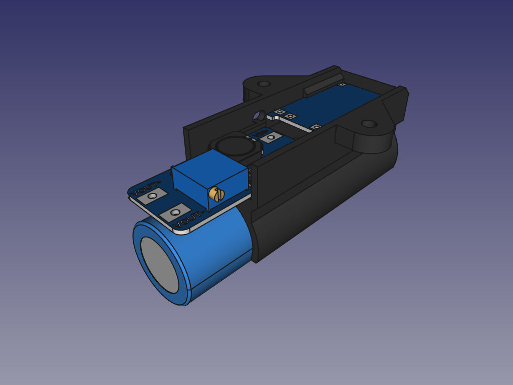

# powerClon-v2
Inspired on the [powerClon model](https://cad.onshape.com/documents/bd55f1e7f8c7c7047d78f493/w/0b57fc30a668b0c107190626/e/79a2e1d208a18e4f4fe7bb4f) by Bernardo, from our project [mClon](https://mclon.org).

## LICENSE

This work is licensed under the [GNU General Public License v3.0](../LICENSE-GPLV30). All media and data files that are not source code are licensed under the [Creative Commons Attribution 4.0 BY-SA license](../LICENSE-CCBYSA40).

More information about licenses in [Opensource licenses](https://opensource.org/licenses/) and [Creative Commons licenses](https://creativecommons.org/licenses/).
